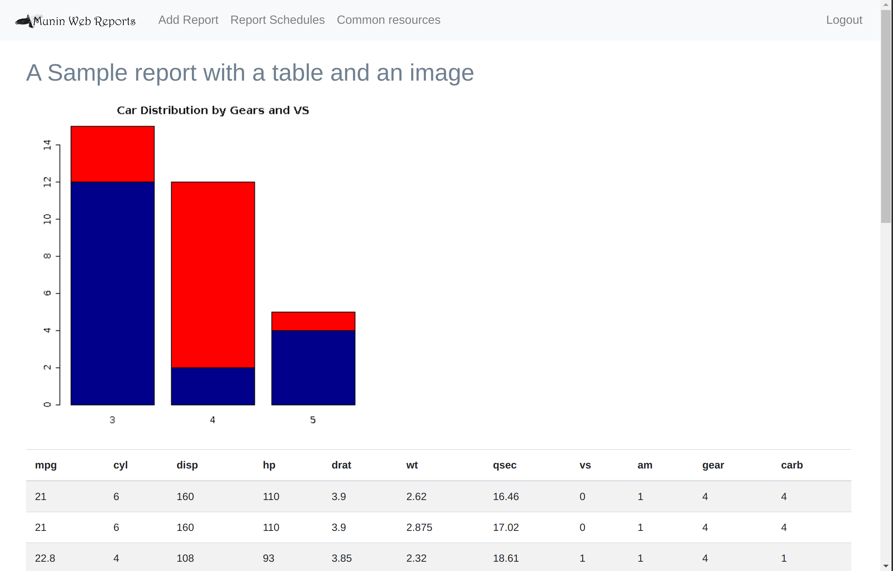

# Munin
This is a report server for reports created in either Journo based on [Freemarker](https://freemarker.apache.org/) or [Groovy](https://groovy-lang.org/) 
. It is an application on [Spring Boot](https://spring.io/projects/spring-boot).
The name comes from the one of Odin's ravens who he sent out every day to scout the world and bring him back reports. 


# Overview
Munin is a reporting server that can run and display reports, created in Freemarker or Groovy, on the web.

Currently, it supports:
- [Groovy reports](docs/groovy-reports.md) where the Groovy code returns html
- [gmd reports](docs/gmd-reports.md) (markdown with support for groovy code - more on that further down)
- [Journo (Freemarker) reports](docs/journo-reports.md) Groovy code handles the parameters to a Freemarker template

[Gade](https://github.com/Alipsa/gade) support the Munin Groovy and gmd report formats natively,
so you can use Gade to create and edit Munin reports.


## Parameterized reports
When publishing a report you can optionally add report parameters in the form of
html form content, e.g:
```html
<div class="form-group">
<label for="firstName">First name</label>
<input id="firstName" name="firstName">
</div>

<div class="form-group">
<select name="dataSet">
   <option value="mtcars">Motor Trend Car Road Tests</option>
   <option value="iris">3 species of iris flowers</option>
</select>
</div>
```

If you want numeric values, you need to convert the parameter to a number.


Note that, in order to be able to schedule a parameterized report, you must provide default parameters in the groovy code
e.g. by using `binding.hasVariable()`. Let's say the parameter is the name of the dataset to use i.e.  
```html
<div class="form-group">
<select name="dataSet">
   <option value="mtcars">Motor Trend Car Road Tests</option>
   <option value="iris">3 species of iris flowers</option>
</select>
</div>
```
Then you can provide a default value for it as follows:
```groovy
if (binding.hasVariable('dataSet')) {
  dataSet = se.alipsa.matrix.datasets.Dataset.iris()
}
```

# Styling
Bootstrap is available, so you can use bootstrap classes to style the form.
If you are using the htmlcreator package, the html.add() functions takes a list of attributes as 
an optional parameter. This way you can add attributes such as id and class like this:
```groovy
html = new se.alipsa.groovy.gmd.Html()
html.add(se.alipsa.matrix.datasets.Dataset.mtcars(), ["id":"mtcars-table", "class": "table table-striped"])
```

You can either upload a common stylesheet (using the "common resources" button) that you can reference in your reports e.g.
```groovy
// import the uploaded stylesheet mystyle.css
html.add("<link rel='stylesheet' href='/common/resources/mystyle.css' />")
```

or, to put it in the head section ([should only be needed](https://html.spec.whatwg.org/multipage/links.html#link-type-stylesheet) if your viewers have very old browsers):
```groovy
// import the uploaded stylesheet mystyle.css
html.add('''
  <script>   
    const cssLink = document.createElement("link");
    cssLink.href = "/common/resources/mystyle.css";
    cssLink.rel="stylesheet";
    document.head.appendChild(cssLink);
  </script>
''')
```

...and you can of course also add stylesheets inline, e.g.
```groovy
// add a style class to adjust the font size of table text:
html.add("""
  <style>
    .table-font-size {
      font-size: 14px;
    }
  </style>
""")
```
then 
```groovy
// reference the class together with some bootstrap classes when rendering a table:
html.add(mtcars, ["class": "table table-striped table-font-size"])
```

# Installing
There are a few different ways to install Munin.

1. Simple:
    - Download the munin-[version].jar file from https://github.com/perNyfelt/munin/releases/latest
    - Copy the jar to a directory of your choice
    - create an application-prod.properties file and override whatever default config you need
    - run the application with `java -Dspring.profiles.active=prod -jar munin-[version]-exec.jar`
      See production config for info on how to make it a service.
      
2. Customized:
   This is appropriate if you want to do more involved customization.
   - Create a new maven (of Gradle or whatever) project and set munin as the parent project:
   
   ```xml
   <parent>
       <artifactId>munin</artifactId>
       <groupId>se.alipsa</groupId>
       <version>2.0.0</version>
   </parent>
   ```
3. Customized alternative:
Fork the project on [github](https://github.com/perNyfelt/munin) and make any changes you want.
Create the executable jar with `mvn clean package` and copy it from your target dir.   

# Demo
The release jar is in "demo" mode meaning it comes with a few user accounts preinstalled, and uses 
a file base h2 database for persistence. 
You start it by simply doing `java -jar munin-[version]-exec.jar`.
The application will be available on http://localhost:8088

See [here](docs/screenshots.md) for some screenshots.

## Admin
The default admin user name / password is admin / adminpwd.
If you log in as admin you will see an "Administration" button on the main page (http://localhost:8088).
There are three predefined roles:
- Viewer: someone who can only view reports. There is one predefined: test / testpwd
- Analyst: someone who can view / add / edit and schedule reports. There is one predefined: analyst /analystpwd
- Admin: someone who can do user/role administration. There is one predefined: admin / adminpwd

## Sample reports
There a few example reports that might help you get going which you can download/copy and publish to the Munin server:
- [Simple](https://github.com/perNyfelt/munin/blob/main/src/test/resources/sampleReport.R): This is a Simple report with a
barplot and a table with some styling.

- [Parameterized](https://github.com/perNyfelt/munin/blob/main/src/test/resources/paramReport.R): This is report 
that show how to do parameterized reports. The [parameters form](https://github.com/perNyfelt/munin/blob/main/src/test/resources/paramReportInput.html)
  provides the input variables used in the report. 
  
- [Pie Chart with External Image](https://github.com/perNyfelt/munin/blob/main/src/test/resources/pieChartWithExternalImage.R):
This reports requires you to upload an external image first (this is to show the use of 
  common content). Download the [iris.jpg](https://github.com/perNyfelt/munin/raw/main/src/test/resources/iris.jpg)
  and upload the content using the "common resources" button you can see if you are logged in as admin or analyst.
  Then you can upload the [pieChartWithExternalImage.R](https://github.com/perNyfelt/munin/blob/main/src/test/resources/pieChartWithExternalImage.R)
  script and publish the report. 
  
- [Table with external CSS](https://github.com/perNyfelt/munin/blob/main/src/test/resources/tableWithExternalCss.R):
This report requires you to upload an external css (another typical us of common content).
  Download the [mystyle.css]((https://github.com/perNyfelt/munin/raw/main/src/test/resources/mystyle.css)
  and upload the content using the "common resources" as described above. You can then create the report
  based on the [tableWithExternalCss.R](https://github.com/perNyfelt/munin/blob/main/src/test/resources/tableWithExternalCss.R)
  script.

# Production config 
You can do any customization by adding an application-prod.properties file next to the jar.
Then start the server with `-Dspring.profiles.active=prod` set e.g.
`java -Dspring.profiles.active=prod -jar munin-[version]-exec.jar`
This will override any default config with your specific config.

## application-prod.properties variables
See application.properties for settings to override. Typically, you will change the following 

### Web port
Set the property `server.port` to something else e.g. `server.port=8080` to listen for
web requests on port 8080 instead of the default 8088.

### Database
The database stores the reports and user config. 
Default config is a file based H2 database (`jdbc:h2:file:./munindb;DATABASE_TO_LOWER=TRUE`) 
To change the underlying database config, set the spring.datasource.xxx parameters 
as you see fit.

There is a braking change between the h2 database used prior to munin version 1.2.0 (i.e. h2 1.4.x) and the h2 
version used in version from 1.20 and later (h2 version 2.1.x). To upgrade the database you need to export the old database 
to SQL and then import in the new version. Essentially you need to the following steps

1. Download the 1.4.200 h2 from https://repo1.maven.org/maven2/com/h2database/h2/1.4.200/h2-1.4.200.jar
2. Backup using `java -cp h2-1.4.200.jar org.h2.tools.Script -url jdbc:h2:file:./munindb -user sa -script test.zip -options compression zip`
3. rename ./munindb.* to ./oldmunindb.*
4. Download 2.210 from https://repo1.maven.org/maven2/com/h2database/h2/2.1.210/h2-2.1.210.jar
5. Restore using `java -cp h2-2.1.210.jar org.h2.tools.RunScript -url jdbc:h2:file:./munindb -user sa -script test.zip -options compression zip FROM_1X`

See the [Upgrade, Backup, and Restore](https://h2database.com/html/tutorial.html#upgrade_backup_restore)
section of the h2 documentation for details. There is also a simple [database migration script](migrateDb.sh) you can use 
(edit credentials etc. appropriately first). For 2.1 to 2.2 upgrade. use the upgradeH2.sh script instead.

Note that if you want another database other than H2, you need to make sure spring boot can access
the jdbc driver jar. This can be done by setting the loader.path, e.g:

1. create a lib folder where your spring boot jar resides
2. copy the additional jar to the lib folder
3. add the path to the folder when starting spring boot:
`java -Dloader.path=file:lib/ -Dspring.profiles.active=prod -jar munin-[version]-exec.jar`

### Mail
Mail is used to email passwords when users are created as well as mailing out scheduled reports.
Set spring.mail.xxx properties (host, port, username, password) as suitable for your mail server.
The "from" address is controlled by the property `munin.email.from`

### Monitoring
Perhaps not something you would typically override, but you likely want to set up some kind of integration
with whatever health monitoring tool you are using at your business.

Actuator is included with default settings which means that a network monitoring tool can
check for availability by querying `http://your-host-name:8088/actuator/health` which will return the
json string `{"status":"UP"}` if everything is normal.


## Run Munin as a service
To run munin as a service, create a [service starter script](https://github.com/perNyfelt/munin/blob/main/src/bin/munin.service)
and make it run as a [Linux service](https://linuxconfig.org/how-to-create-systemd-service-unit-in-linux).
Essentially:
1. Edit the [service starter script](https://github.com/perNyfelt/munin/blob/main/src/bin/munin.service)
1. Copy the script to /etc/systemd/system
1. start the service `sudo systemctl start munin.service`
1. Make sure the service is running `systemctl is-active munin.service`

For a [Windows service](https://github.com/perNyfelt/munin/blob/main/src/bin/munin-windows.xml) see [winsw](https://github.com/winsw/winsw).
Essentially you do:
1. Take WinSW.NET4.exe (or WinSW.NETCore31.x64.exe if you do not have .NET installed) from the [distribution](https://github.com/winsw/winsw/releases/latest), and rename it to munin-windows.exe.
1. Edit [munin-windows.xml](https://github.com/perNyfelt/munin/blob/main/src/bin/munin-windows.xml) to match your file locations.
1. Place those two files side by side.
1. Run `munin-windows.exe install` to install the service.
1. Run `munin-windows.exe start` to start the service.

See the [Spring documentation](https://docs.spring.io/spring-boot/docs/current/reference/html/deployment.html#deployment-service)
for more info.

## Other configuration tasks
The first thing you should probably do after setting up a database and providing the necessary config overrides 
is to change / remove the three predefined users using the admin interface mentioned in the demo section above.
If you want to keep the admin user, begin by assigning your email to it and then log out and reset the password -
 a new password will then be emailed to you.

# Integration
Munin provides a REST api for integration with other applications. It is described [here](api.md).

# Reusing code
You might notice that you have code snippets that you want to centralize and reuse. The standard approach
to that is to formulate those code snippets into classes that you include in a library that you publish to a Nexus 
server and include in your script using @Grab.

An alternative way is to upload the groovy code into the common resource area and source it from the report e.g.
```groovy
def utils = evaluate("$muninBaseUrl/common/resources/utils.groovy".toURL().text)
```

# 3:rd party dependencies

### [Renjin](https://github.com/bedatadriven/renjin)
- R interpreter for the JVM; used to execute reports
- License: GNU General Public License v2.0

### [Spring boot](https://github.com/spring-projects/spring-boot)
- The application server framework providing most of the functionality
- License: Apache License 2.0

### [renjin-spring-boot-starter](https://github.com/perNyfelt/renjin-spring-boot-starter)
- Integration of Renjin with Spring boot
- License: MIT

### [htmlcreator](https://github.com/perNyfelt/htmlcreator)
- renjin extension (package) to create html from R objects (data.frames, images etc)
- License: MIT

### [mdr2html](https://github.com/perNyfelt/mdr2html)
- renjin extension (package) to create html from mdr files / content
- License: MIT

### [commons-io](https://commons.apache.org/proper/commons-io/)
- Various IO stuff
- License: Apache License 2.0

### [commons-collections4](https://commons.apache.org/proper/commons-collections/)
- Used to handle various collection transformations
- License: Apache License 2.0

### [cron-utils](https://github.com/jmrozanec/cron-utils)
- Used to parse cron expressions to provide "plain english" descriptions for them.
- License: Apache License 2.0

### [webjars-locator](http://webjars.org)
- Simplifies web resource locations
- License: MIT

### [webjars bootstrap](http://webjars.org)
- Pretty web pages
- License: Apache License 2.0

### [webjars jquery](http://webjars.org)
- More convenient javascripts
- License: MIT

### [webjars codemirror](http://webjars.org)
- Syntax highlighting for R and html code
- License: MIT

### [highlightjs](https://highlightjs.org/)
- Syntax highlighting for mdr reports
- License: BSD 3-Clause

See the [pom.xml](https://github.com/perNyfelt/munin/blob/main/pom.xml) for more details...

